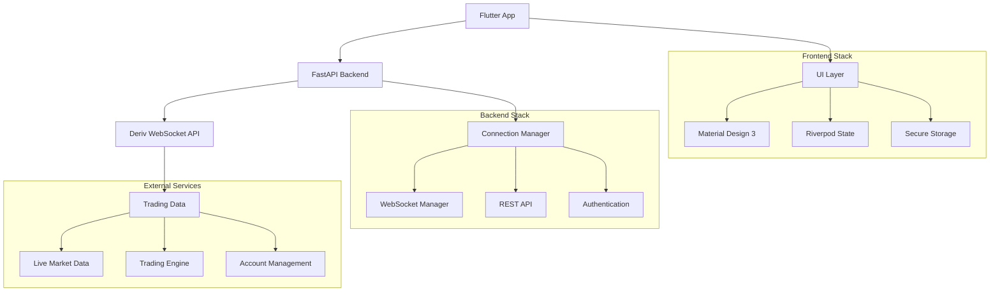
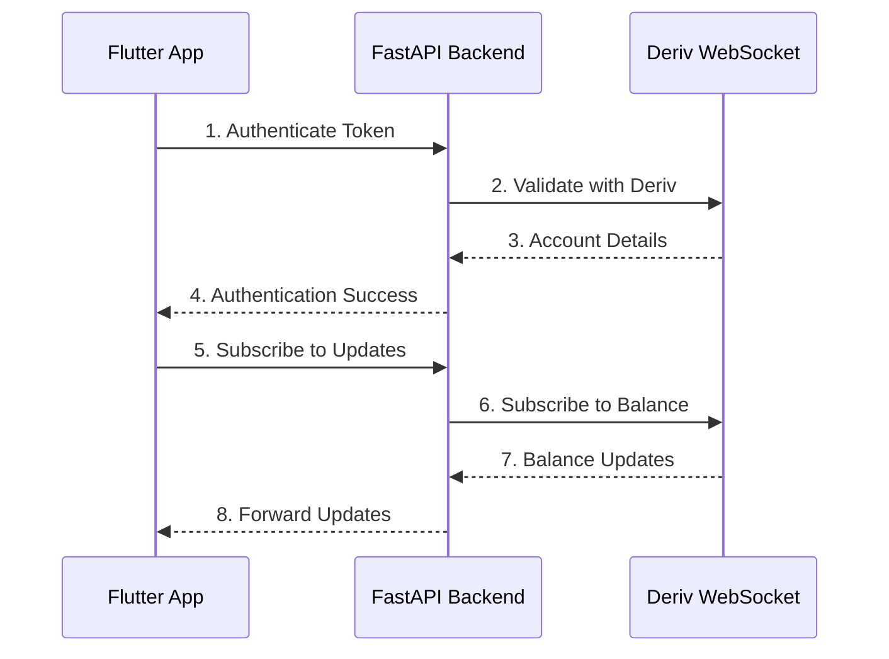

# G-Trades - Professional Derivative Trading Platform

---

  <strong>🚀 A professional derivative trading application built with Flutter and FastAPI, connecting to Deriv's trading platform for real-time volatility index trading.</strong>

  
**[📱 Download](https://github.com/your-username/g-trades/releases)** • 
**[📚 Documentation](#user-guide)** • 
**[🐛 Report Bug](https://github.com/your-username/g-trades/issues)** • 
**[✨ Request Feature](https://github.com/your-username/g-trades/issues)**

---

## 📋 Table of Contents

- [🚀 Overview](#overview)
- [✨ Features](#features)
- [🏗️ Architecture](#architecture)
- [📱 User Guide](#user-guide)
- [👨‍💻 Developer Documentation](#developer-documentation)
- [📚 API Reference](#api-reference)
- [📸 Screenshots](#screenshots)
- [🤝 Contributing](#contributing)
- [📄 License](#license)
- [📞 Contact](#contact)

## 🚀 Overview

  
  
  

G-Trades is a professional derivative trading application that allows you to trade volatility indices and synthetic assets through the Deriv platform. It features a modern Flutter frontend with a FastAPI backend that manages WebSocket connections to Deriv's trading platform.

### 🎯 What Makes G-Trades Special?

<table>
<tr>
<td align="center">🎯 <strong>Specialized Focus</strong> Built specifically for volatility index trading</td>
<td align="center">⚡ <strong>Real-Time Performance</strong> Live balance updates and instant market data</td>
<td align="center">🔒 <strong>Security First</strong> Your tokens are never shared with third parties</td>
</tr>
<tr>
<td align="center">📱 <strong>Cross-Platform</strong> Works on Android, iOS, Windows, macOS, and web browsers</td>
<td align="center">🛡️ <strong>Secure Trading</strong> All trading goes directly through Deriv's official API</td>
<td align="center">🌟 <strong>Premium UI</strong> Material Design 3 with dark/light themes</td>
</tr>
</table>

## ✨ Features

  

### ✅ Current Features (v1.0)

<strong>🔐 Authentication & Security</strong>

- ✅ **User Authentication** with Deriv API token validation
- ✅ **Secure Token Storage** using Flutter Secure Storage
- ✅ **Automatic Demo/Real Account Detection**
- ✅ **Session Management** with automatic token refresh

<strong>💰 Real-Time Trading</strong>

- ✅ **Real-Time Balance Updates** via WebSocket connections
- ✅ **Live Market Data** with instant price updates
- ✅ **Digit Contract Trading** with various durations and stakes
- ✅ **Instant Trade Execution** through Deriv API

<strong>📊 Market Analysis</strong>

- ✅ **Volatility Index Browsing** with comprehensive market data
- ✅ **Trading History Tracking** with detailed profit/loss analysis
- ✅ **Market Status Indicators** (open/closed markets)
- ✅ **Historical Price Data** access

<strong>🎨 User Experience</strong>

- ✅ **Cross-Platform Support** for all major platforms
- ✅ **Dark/Light Theme Support** with system preference detection
- ✅ **Responsive Design** optimized for all screen sizes
- ✅ **Material Design 3** with premium animations

### 🚧 Planned Features

  

| Feature | Status | Description |
|---------|--------|-------------|
| 📈 Advanced Charting | 🔄 In Progress | Technical analysis with professional indicators |
| 📊 Portfolio Analytics | 📋 Planned | Comprehensive performance tracking |
| 🔔 Smart Notifications | 📋 Planned | Price alerts and trade notifications |
| 🌐 Multi-Language | 📋 Planned | Support for multiple languages |
| 🤖 Auto Trading | 🔮 Future | Automated trading strategies |
| 📱 Advanced Mobile | 🔮 Future | Enhanced mobile-specific features |

## 🏗️ Architecture

G-Trades follows a backend-first architecture with real-time communication:

### 🛠️ Technical Stack

| Component | Technology | Purpose |
|-----------|------------|---------|
| **Frontend** |  | Cross-platform UI framework |
| **Backend** |  | High-performance web framework |
| **State Management** |  | Reactive state management |
| **Real-time** |  | Live data communication |
| **Security** |  | Token encryption & storage |

#### 🎨 Frontend (Flutter)
- **Framework**: Flutter with Dart for cross-platform development
- **State Management**: Riverpod for reactive and scalable state management
- **UI Components**: Custom premium widgets with Material Design 3
- **Security**: Flutter Secure Storage for encrypted token management
- **Real-time Communication**: WebSocket client for live data updates
- **Cross-platform**: Native performance on all supported platforms

#### ⚡ Backend (FastAPI)
- **Framework**: FastAPI with uvicorn ASGI server for high performance
- **WebSocket Management**: Custom DerivManager class for handling multiple connections
- **API Integration**: Direct integration with Deriv WebSocket API
- **Authentication**: Secure token-based authentication system
- **Real-time Data**: WebSocket forwarding for live balance and market updates

## 📱 User Guide

### 🎯 What Can You Do with G-Trades?

#### 1. **🔐 Connect Your Deriv Account**
Connect securely to your Deriv trading account with these simple steps:

- Enter your Deriv API token to establish a secure connection
- Automatic detection of demo or real account status
- Encrypted local storage of your credentials
- One-time setup with persistent authentication

#### 2. **📊 View Your Trading Dashboard**
Access a comprehensive overview of your trading environment:

- **Real-time Balance**: Live updates of your account balance
- **Profile Information**: Complete account details and status
- **Connection Status**: Monitor your connection to Deriv's servers
- **Quick Actions**: Instant refresh and account management tools

#### 3. **🌍 Explore Volatility Indices**
Discover and analyze available trading markets:

- **Market Browser**: Browse all available volatility indices
- **Live Pricing**: Real-time price updates and market data
- **Market Status**: Clear indicators for open/closed markets
- **Detailed Information**: Comprehensive market specifications

#### 4. **💹 Trade Digit Contracts**
Execute professional trades with advanced features:

- **Contract Selection**: Multiple contract types and durations
- **Risk Management**: Customizable stake amounts and parameters
- **Instant Execution**: Real-time trade placement and confirmation
- **Profit Tracking**: Immediate profit/loss calculations

#### 5. **📈 Monitor Your Trading History**
Track and analyze your trading performance:

- **Complete History**: Detailed record of all past trades
- **Performance Metrics**: Comprehensive profit/loss analysis
- **Trade Details**: Full transaction information and timestamps
- **Export Options**: Download your trading data

### 🎯 Trading Types Available

| Trading Type | Description | Duration | Stake Range |
|--------------|-------------|----------|-------------|
| **📊 Digit Contracts** | Predict last digit outcomes | 1 min - 1 hour | $0.35 - $50,000 |
| **📈 Volatility Indices** | Trade synthetic markets | 24/7 | Flexible |

#### **📊 Digit Contracts**
- Predict whether the last digit will be higher or lower
- Multiple duration options from 1 minute to 1 hour
- Flexible stake amounts to match your risk tolerance
- Clear and transparent profit/loss calculations

#### **📈 Volatility Indices**
- Trade on synthetic volatility markets
- 24/7 availability unlike traditional markets
- Various volatility index types for diversification
- Professional trading environment with institutional-grade tools

## 👨‍💻 Developer Documentation

### 🔧 Key Components

#### Backend Architecture

<strong>🔌 DerivManager</strong>

Central class managing WebSocket connections to Deriv with:
- Connection pooling and management
- Automatic reconnection logic
- Message routing and handling
- Error recovery mechanisms

<strong>🛣️ FastAPI Routes</strong>

RESTful endpoints providing:
- Authentication and token validation
- Market data retrieval
- Trade execution endpoints
- Historical data access

<strong>🔄 WebSocket Endpoints</strong>

Real-time communication handling:
- Live balance updates
- Market data streaming
- Trade notifications
- Connection state management

#### Frontend Architecture

<strong>🎭 ProfileProvider</strong>

Riverpod provider managing:
- Authentication state
- User profile data
- Session persistence
- Security validation

<strong>🌐 WebSocketService</strong>

Real-time communication service:
- Connection management
- Message serialization
- Error handling
- Automatic reconnection

<strong>🎨 Custom Widgets</strong>

Premium UI components featuring:
- Material Design 3 compliance
- Consistent styling system
- Responsive layouts
- Accessibility support

### 📊 Data Flow

### 🔒 Security Features

| Security Layer | Implementation | Purpose |
|----------------|---------------|----------|
| **Token Encryption** | Flutter Secure Storage | Protect API credentials |
| **Validation** | Server-side token verification | Ensure authenticity |
| **Connection Security** | HTTPS/WSS protocols | Secure data transmission |
| **Session Management** | Automatic cleanup | Prevent security leaks |
| **CORS Protection** | Middleware configuration | Control access origins |

## 📚 API Reference

### 🌐 REST Endpoints

| Endpoint | Method | Description | Status |
|----------|--------|-------------|--------|
| `/api/auth` | POST | Validate Deriv token and detect account type | ✅ Active |
| `/api/markets` | GET | Fetch volatility indices | ✅ Active |
| `/api/tick-history/{symbol}` | GET | Get historical price data | ✅ Active |
| `/api/contracts/{symbol}` | GET | Get available contracts for a symbol | ✅ Active |
| `/api/buy-contract` | POST | Execute contract purchases | ✅ Active |
| `/api/open-contract/{contract_id}` | GET | Get open contract details | ✅ Active |
| `/api/profit-table` | GET | Retrieve trading history | ✅ Active |

### 🔌 WebSocket Endpoints

| Endpoint | Description | Features |
|----------|-------------|----------|
| `WS /ws/{connection_id}` | Real-time communication channel | Balance updates, Market data, Trade notifications |

## 📸 Screenshots

*Professional interface screenshots will be added here showcasing the modern Material Design 3 interface, trading screens, and comprehensive dashboard.*

## 🤝 Contributing

We welcome contributions to G-Trades! Whether you're fixing bugs, adding features, or improving documentation, your help is appreciated.

### 🌟 Ways to Contribute

- 🐛 **Bug Reports**: Found an issue? Let us know!
- ✨ **Feature Requests**: Have an idea? We'd love to hear it!
- 📖 **Documentation**: Help improve our docs
- 🛠️ **Code Contributions**: Submit pull requests
- 🧪 **Testing**: Help us test new features

## 📄 License

This project is licensed under the MIT License - see the [LICENSE](LICENSE) file for details.

### MIT License Summary

Copyright (c) 2024 The Grit Agencies

Permission is hereby granted, free of charge, to any person obtaining a copy of this software and associated documentation files (the "Software"), to deal in the Software without restriction, including without limitation the rights to use, copy, modify, merge, publish, distribute, sublicense, and/or sell copies of the Software, and to permit persons to whom the Software is furnished to do so, subject to the following conditions:

The above copyright notice and this permission notice shall be included in all copies or substantial portions of the Software.

THE SOFTWARE IS PROVIDED "AS IS", WITHOUT WARRANTY OF ANY KIND, EXPRESS OR IMPLIED, INCLUDING BUT NOT LIMITED TO THE WARRANTIES OF MERCHANTABILITY, FITNESS FOR A PARTICULAR PURPOSE AND NONINFRINGEMENT. IN NO EVENT SHALL THE AUTHORS OR COPYRIGHT HOLDERS BE LIABLE FOR ANY CLAIM, DAMAGES OR OTHER LIABILITY, WHETHER IN AN ACTION OF CONTRACT, TORT OR OTHERWISE, ARISING FROM, OUT OF OR IN CONNECTION WITH THE SOFTWARE OR THE USE OR OTHER DEALINGS IN THE SOFTWARE.

✅ **Permissions**: Commercial use, Modification, Distribution, Private use  
❌ **Limitations**: Liability, Warranty  
📋 **Conditions**: License and copyright notice

## 📞 Contact

### 👨‍💻 Developer Information

<table align="center">
<tr>
<td align="center">

  
<strong>Lead Developer</strong> 
📱 <a href="tel:0743269238">0743269238</a> 
🏢 The Grit Agencies 
🚀 G-Trades v1.0.0 
📅 Released 2025
</td>
</tr>
</table>

### 🏢 About The Grit Agencies

The Grit Agencies is a software development company specializing in financial technology solutions. We are committed to creating professional-grade trading applications that provide secure, reliable, and user-friendly experiences for traders worldwide.

### 🆘 Support Channels

| Support Type | Contact Method | Response Time |
|--------------|---------------|---------------|
| **Technical Support** | 📱 0743269238 | 24-48 hours |
| **Feature Requests** | 🐛 [GitHub Issues](https://github.com/your-username/g-trades/issues) | 1-3 days |
| **General Inquiries** | 📧 Contact Developer | 48 hours |

### 🙏 Acknowledgments

- **[Deriv.com](https://deriv.com)** - Trading API and platform provider
- **[Flutter Team](https://flutter.dev)** - Cross-platform framework excellence
- **[FastAPI Team](https://fastapi.tiangolo.com)** - Modern Python web framework
- **Open Source Community** - Libraries, tools, and inspiration

---

## ⚠️ Terms and Conditions

### 📋 Software License Agreement

This software is provided "as is" without warranty of any kind. Users are responsible for ensuring proper authorization and compliance with applicable laws. Trading involves financial risk and may result in losses.

### 🔐 Data Privacy

- API tokens stored securely on your device using Flutter Secure Storage
- No personal trading data transmitted to external servers
- All operations conducted through Deriv's official API
- Users retain full control over trading data and credentials

### ✅ Acceptance of Terms

By using this software, you acknowledge that you have read, understood, and agree to be bound by these terms and conditions.

---

  <strong>© 2025 The Grit Agencies. All rights reserved.</strong>

  Crafted with ❤️ by <a href="tel:0743269238"><strong>Griffins Mbae</strong></a> at <strong>The Grit Agencies</strong>

